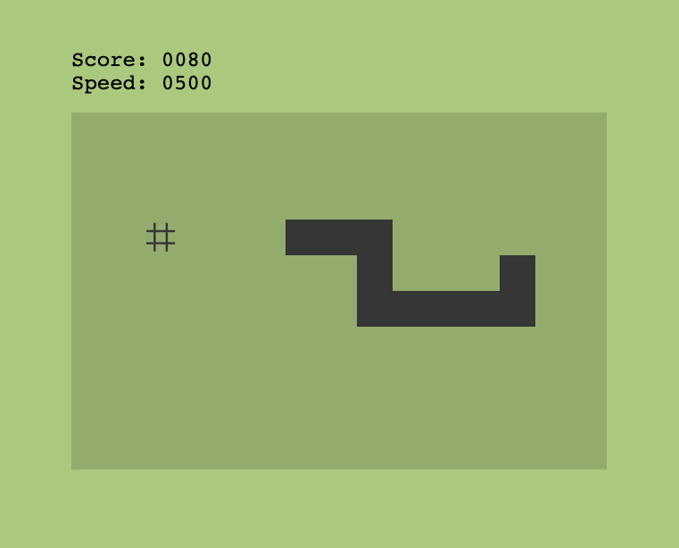

# Elm Snake Game

An implementation of the classic Snake Game in Elm.



To run the app you need [create-elm-app](https://github.com/halfzebra/create-elm-app).

```
npm i -g create-elm-app
```

Then `elm-app start` will open the game in a browser window `http://localhost:3000`

Use the `up`, `down`, `left`, `right` arrow keys to move the snake.
